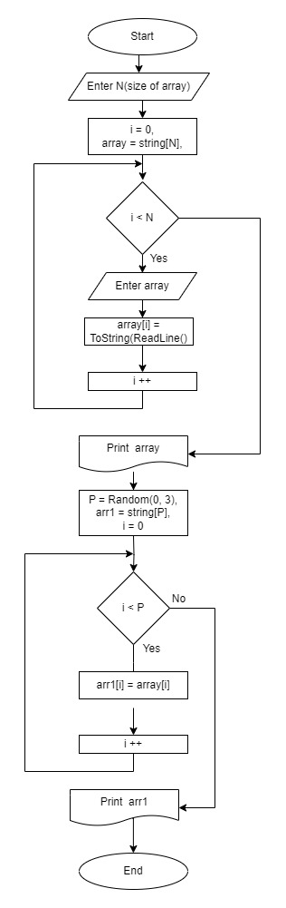

## Контрольная работа

1. Создать репозиторий на GitHub
2. Нарисовать блок-схему алгоритма (можно обойтись блок-схемой основной содержательной части, если вы выделяете её в отдельный метод)
3. Снабдить репозиторий оформленным текстовым описанием решения (файл README.md)
4. Написать программу, решающую поставленную задачу
5. Использовать контроль версий в работе над этим небольшим проектом (не должно быть так, что всё залито одним коммитом, как минимум этапы 2, 3, и 4 должны быть расположены в разных коммитах)

**Задача:** Написать программу, которая из имеющегося массива строк формирует новый массив из строк, длина которых меньше, либо равна 3 символам. Первоначальный массив можно ввести с клавиатуры, либо задать на старте выполнения алгоритма. При решении не рекомендуется пользоваться коллекциями, лучше обойтись исключительно массивами.*

Примеры:
- [“Hello”, “2”, “world”, “:-)”] → [“2”, “:-)”]
- [“1234”, “1567”, “-2”, “computer science”] → [“-2”]
- [“Russia”, “Denmark”, “Kazan”] → []

**Решение:** 

1. Начало
2. По запросу вводится размер массива **N** с консоли больше 2-х.
3. Формируется массив строк **array**.
4. Вводится массив с консоли, каждый элемент + Enter.
5. Массив распечатывается ввиде строки.
6. Т.к. нам нужен массив состоящий из элементов основного, но не более 3-х элементов, объвляется случайная переменная **P<3**.
7. Объявляется новый массив **arr1** размером **Р**.
8. Производится выборка 3-х  <= элементов в массив **arr1** из массива **array**.
9. Массив **arr1** распечатывается ввиде строки.
10. Конец.

Алгоритм решения представлен на рис. Алгоритм.jpg 
